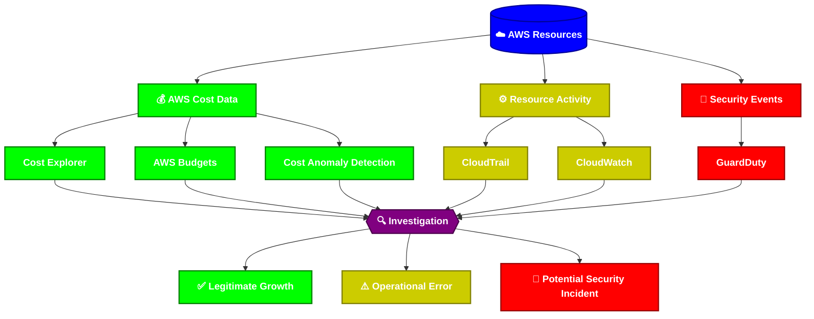

# OakForge Cloud Cost Security & Intelligence

**AWS Cloud Transformation — Project 1**

> A practical AWS solution for detecting, investigating, and responding to unexpected cloud spending.

## Overview

OakForge Solutions is moving its workloads to AWS and needs better visibility into cloud spending.

The project answers one key question:

**Why did our AWS costs increase?**

The solution combines **cost monitoring, operational monitoring, and security logging** to determine whether unexpected spending is caused by legitimate business growth, an operational mistake, or potentially suspicious activity.

## Business Problem

Unexpected AWS costs can result from:

- 📈 Legitimate increases in business traffic
- 🖱️ Accidental resource deployments
- 💤 Unused or oversized resources
- 🔓 Potentially compromised credentials

OakForge needs a way to detect unusual spending and investigate its root cause.

## 🏗️ Solution

The platform connects AWS cost data with operational and security visibility.

## 🧰 AWS Services

| Service | Purpose |
|---|---|
| 💰 **AWS Cost Explorer** | Analyze cloud spending |
| 📊 **AWS Budgets** | Set spending thresholds |
| 🔍 **Cost Anomaly Detection** | Detect unusual spending |
| 📈 **Amazon CloudWatch** | Monitor resources, metrics, logs, and alerts |
| 🧾 **AWS CloudTrail** | Track AWS API activity |
| 🛡️ **Amazon GuardDuty** | Detect potential security threats |
| 🔑 **AWS IAM** | Manage identities and permissions |
| 📣 **Amazon SNS** | Deliver notifications |

## 🔎 Investigation & Incident Response

The project uses two related processes.

### General Investigation Flow

This is the initial triage process used for every cost anomaly:

**Detect → Identify → Investigate → Classify → Respond**

A detected anomaly is investigated using cost data, CloudWatch activity, CloudTrail events, and GuardDuty findings.

The activity is then classified as:

| Outcome | Meaning |
|---|---|
| ✅ **Legitimate growth** | Continue monitoring |
| ⚠️ **Operational error** | Remediate unnecessary resources |
| 🚨 **Potential security incident** | Investigate and contain |

> Not every cost anomaly is a security incident.

### Level 3 Incident Response

If an investigation confirms a serious security incident, the project follows a more detailed six-stage response lifecycle:

**Detect → Validate → Investigate → Contain → Remediate → Recover / Review**

This separation prevents legitimate cost increases or simple operational mistakes from being treated as security incidents.

## 🧪 Test Scenarios

### 1️⃣ Legitimate Business Growth
Increased business traffic causes higher AWS resource usage and spending.

**Expected outcome:** ✅ The increase is validated as legitimate business activity.

### 2️⃣ Accidental Deployment
Unnecessary or oversized resources cause an unexpected cost increase.

**Expected outcome:** ⚠️ The responsible resource and activity are identified and remediated.

### 3️⃣ Potential Security Incident
Suspicious activity results in unexpected AWS resource usage.

**Expected outcome:** 🚨 The activity is investigated and, if confirmed as a security incident, contained and remediated.

## 🔐 Security Controls

| Control | Purpose |
|---|---|
| 🔑 **IAM Least Privilege** | Limit access to only what users and services require |
| 📱 **MFA** | Protect privileged identities |
| 🧾 **CloudTrail** | Provide accountability for AWS API activity |
| 📈 **CloudWatch** | Monitor AWS resources and operational activity |
| 🛡️ **GuardDuty** | Detect potential malicious activity |
| 🏷️ **Resource Tagging** | Improve resource and cost visibility |
| 🔒 **Credential Management** | Reduce risks associated with compromised credentials |

## 💵 Cost Safeguards

- ✅ Configure an AWS Budget before deployment
- ✅ Use appropriately sized resources
- ✅ Avoid unnecessary high-cost services
- ✅ Configure appropriate log retention
- ✅ Remove temporary resources after testing
- ✅ Review AWS costs after each scenario
- ✅ Perform a final resource audit

## 🛠️ Implementation

The project will be built incrementally:

1. Build the OakForge AWS environment
2. Establish cost visibility
3. Configure AWS Budgets
4. Configure Cost Anomaly Detection
5. Integrate CloudTrail
6. Integrate CloudWatch
7. Enable GuardDuty
8. Build the investigation workflow
9. Test the three scenarios
10. Document results and lessons learned

Detailed implementation documentation will be maintained in the `docs` directory.

## 🎯 Skills Demonstrated

`AWS Cloud` `Cloud Cost Management` `Cloud Security` `IAM` `EC2` `CloudWatch` `CloudTrail` `GuardDuty` `AWS Budgets` `Cost Anomaly Detection` `Monitoring` `Incident Investigation` `Cloud Governance`

## 🚀 OakForge Transformation

This project represents the first stage of OakForge's AWS cloud transformation:

**Cost Visibility → Operational Visibility → Security Awareness**

Future OakForge projects will extend the transformation into:

**Secure Infrastructure → Resilience → Automation → Application Modernization → Data & AI**
